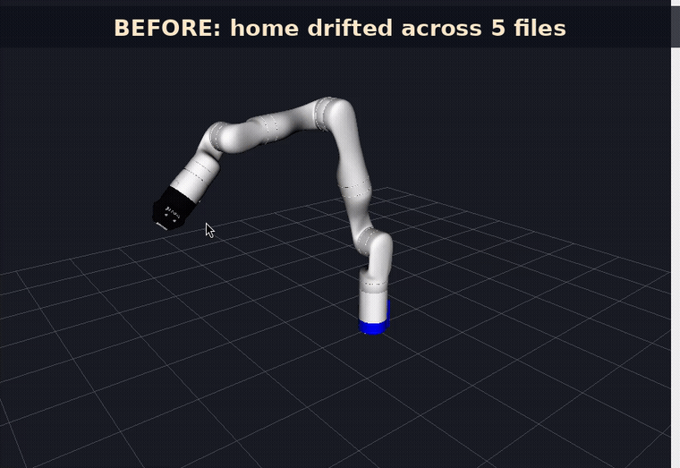
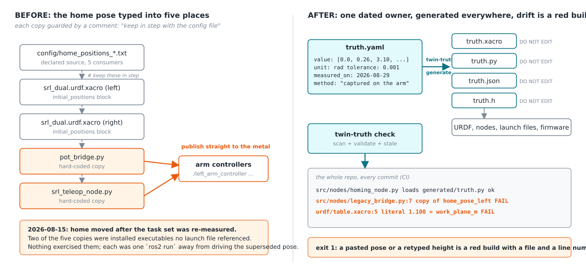
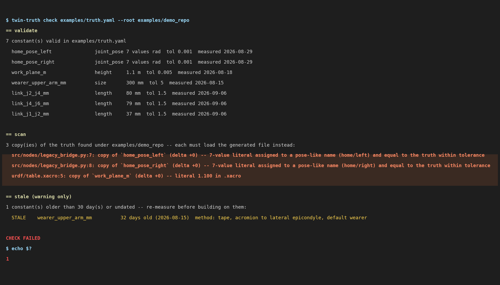
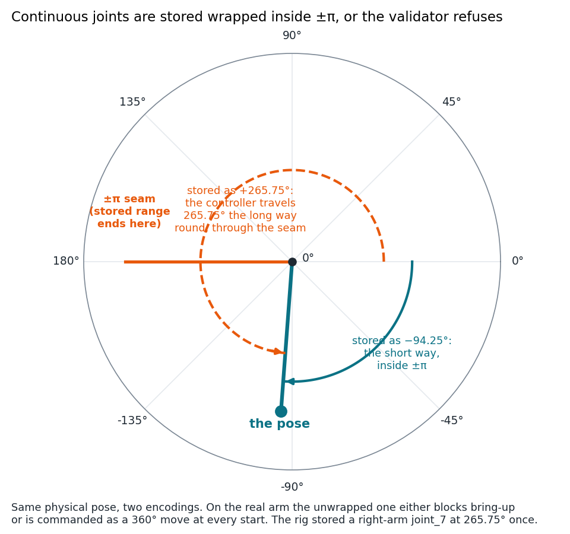
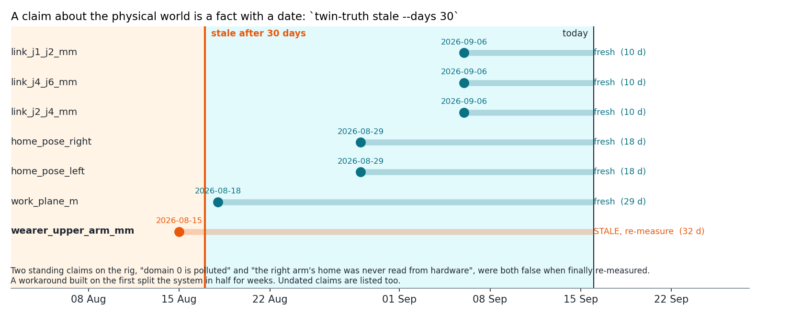
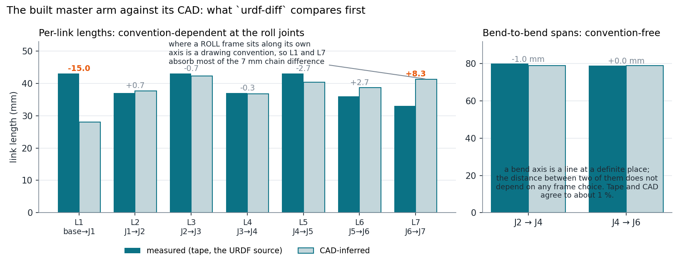

# twin-truth



*Four test scenarios in RViz (Kinova Gen3).*

**One dated source of truth for every physical constant in a digital twin. Generated everywhere. Drift is a failing test, not a comment.**

A digital twin is only as good as the numbers that describe the metal: home poses, link lengths, the height of the table, the size of the person standing in the workspace. Those numbers have a way of getting copied. This tool makes each of them live in exactly one place, with a unit, a date, a method and a tolerance, generates every consumer file from it, and fails CI the day a copy appears anywhere else.

```
$ twin-truth check truth.yaml --root .
== scan
3 copy(ies) of the truth found under . -- each must load the generated file instead:
  src/nodes/legacy_bridge.py:7: copy of `home_pose_left` (delta +0) -- 7-value literal assigned to a pose-like name (home/left) and equal to the truth within tolerance
  src/nodes/legacy_bridge.py:8: copy of `home_pose_right` (delta +0) -- 7-value literal assigned to a pose-like name (home/right) and equal to the truth within tolerance
  urdf/table.xacro:5: copy of `work_plane_m` (delta +0) -- literal 1.100 in .xacro
CHECK FAILED
```

Pure Python 3.10+, one dependency (PyYAML), no ROS required.

## The problem

- **The home pose lived in FIVE places, not two.** A config text file was the declared source. The URDF carried it twice, once per arm, as the sim's spawn pose. Two nodes carried their own hard-coded copies, and both published straight to the arm controllers. When home moved on 2026-08-15 after the whole task set had been re-measured, those two copies would have driven the real arms to the superseded pose. Each copy had a comment beside it saying "keep in step with the config file". A comment cannot fail.
- **Two work-surface heights, 150 mm apart.** `BENCH_TOP = 1.10` positioned every object; `TABLE_TOP = 0.950` was the only geometry anything collided with. Nothing compared them. Objects floated, the planner reasoned about a table that was not where the objects were, and the discrepancy was only found by measuring clearance geometrically.
- **The wearer's size was baked in.** The posture of the person wearing the rig became a variable; their size did not. Every workspace figure for a month described a 300 mm upper arm and a 360 mm chest regardless of who was standing there, because the number was typed into the model rather than declared.

Each was fixed the same way: one owner for the fact, every consumer loads it, and a test that fails when a second copy appears. twin-truth is that pattern packaged.



*Before: one home pose typed into five places, two of them publishing straight to the arm controllers. After: one dated `truth.yaml`, every consumer generated from it, and a check that fails CI on the first copy.*

## What it does

| command | what it answers |
| --- | --- |
| `validate` | Is the truth file well-formed? Units known, tolerances present, dates parse, continuous joints stored inside ±π. |
| `generate` | Emit `truth.xacro`, `truth.py`, `truth.json`, `truth.generated.yaml`, `truth.h` from the truth file. Deterministic, bannered `DO NOT EDIT`. |
| `scan` | Does any file under the repo carry a copy of a constant? Python is checked by syntax tree, everything else by number within tolerance. |
| `urdf-diff` | Do the URDF's joint origins agree with the tape measure? Reports convention-free bend-to-bend spans first. |
| `stale` | Which constants were measured more than N days ago, or never? |
| `check` | `validate` + `scan` + `stale` in one command, with an exit code for CI. |

## Install

```
pip install git+https://github.com/megazron/twin-truth
```

## Quickstart

1. Write `truth.yaml` at the root of your robot repo:

```yaml
version: 1
allow: ["docs/**"]                     # reference-only files the scanner may skip

constants:
  home_pose_left:
    value: [0.0, 0.2618, 3.1, -2.2689, 0.0, 0.9599, 1.5708]
    unit: rad
    kind: joint_pose
    continuous_joints: [0, 2, 4, 6]    # must be stored wrapped inside ±pi
    measured_on: 2026-08-29
    method: "solved by IK search; captured on the left arm 2026-08-29"
    tolerance: 0.001

  work_plane_m:
    value: 1.100
    unit: m
    kind: height
    measured_on: 2026-08-18
    method: "tape from the floor to the table top with the rig standing"
    tolerance: 0.005
    scan: true                         # search for this literal even though it is short

  link_j2_j4_mm:
    value: 80.0
    unit: mm
    kind: length
    measured_on: 2026-09-06
    method: "tape on the built arm, bend axis to bend axis"
    tolerance: 1.5
    urdf_span: [joint_2, joint_4]      # compared by urdf-diff
```

2. Generate the consumers and use them:

```
twin-truth generate truth.yaml --out-dir generated/
```

```xml
<!-- robot.urdf.xacro -->
<xacro:include filename="$(find my_robot)/generated/truth.xacro"/>
<origin xyz="0 0 ${work_plane_m}"/>
<joint name="joint_3" ...><xacro:property name="q0" value="${home_pose_left_2}"/>
```

```python
# any node
from generated.truth import HOME_POSE_LEFT, WORK_PLANE_M, as_rad, meta
target = as_rad("home_pose_left")          # radians whatever unit the truth declared
```

3. Put the check in CI:

```yaml
- run: pip install git+https://github.com/megazron/twin-truth
- run: twin-truth check truth.yaml --root . --exclude build/ --exclude install/
```

From now on, a pasted pose or a retyped height is a red build with a file and line number.



*The real output of `twin-truth check` on the bundled demo repo: two hard-coded home poses in a legacy node and a typed `1.100` in a xacro, all three caught.*

## The truth file

Top level: `version: 1`, `constants:` (a mapping), optional `allow:` (globs the scanner skips; use it for documentation and reference-only files).

Each constant:

| field | required | meaning |
| --- | --- | --- |
| `value` | yes | a number or a list of numbers |
| `unit` | yes | `rad deg m mm cm kg g s ms hz n nm ratio count` |
| `tolerance` | yes | how close a number must be to count as a copy, and the pass band for `urdf-diff` |
| `kind` | no | `joint_pose length height offset angle size other` (default `other`) |
| `measured_on` | no, but `stale` will name you | ISO date |
| `method` | no | how it was measured, in words |
| `continuous_joints` | `joint_pose` only | indices that must be stored wrapped inside ±π |
| `urdf_joints` | length-like | two joint names; `urdf-diff` compares consecutive origin distance |
| `urdf_span` | length-like | two joint names; `urdf-diff` compares the convention-free span |
| `scan` | no | force the text scanner on (`true`) or off (`false`) for this constant |
| `consumers`, `note` | no | documentation only |

A `joint_pose` with a continuous joint stored outside ±π is refused with the wrapped value in the message. The rig once stored a right-arm joint_7 at 265.75°; on the real arm that either blocks bring-up or commands a 360° move at every start. It had to be −94.25°.



*Why the validator refuses a continuous joint stored at 265.75 deg: across the +/-pi seam the same angle is -94.25 deg, and a real arm commanded the long way round makes a 360 deg move.*



*A claim about the physical world is a fact with a date. `twin-truth stale` lists what is older than the rule you set.*

## Commands

### `twin-truth scan truth.yaml --root REPO [--exclude GLOB]...`

Two detectors, because copies appear two ways.

**Python, by syntax tree.** Any literal list with as many elements as a declared pose, assigned to a name containing `home`, `pose`, `q0` or `initial` (including dict keys and attributes: `self.home = {"left": [...]}`), is reported. So is any list literal anywhere, argument or dict value or assignment, whose values equal a declared pose within its tolerance. The name rule is deliberately structural: it fires on a pasted NEW pose too, which is the case a match on the old numbers would wave through.

**Text, by number.** In `.py .xacro .urdf .yaml .yml .json .cfg .txt .launch .srdf .xml`, any literal equal to a declared scalar within its tolerance and written to at least the constant's precision. Only constants with four or more significant digits are searched for unless `scan: true` is set, so `1.0` does not light up the whole tree. Comment lines are skipped.

Skipped: generated files (recognised by their banner), the truth file itself, `build install log .git __pycache__ *.egg-info .venv`, anything in `allow:`, anything in `--exclude`. Exit 1 if any copy is found.

### `twin-truth urdf-diff truth.yaml robot.urdf [--base-link NAME]`

Parses a plain URDF (run `xacro` first if you have one; the tool says so), chains joint origins through the tree with the proper rotations, and compares:

- `urdf_joints: [a, b]`: distance between the two joint origins, as the URDF has them.
- `urdf_span: [a, b]`: the same distance, but you have chosen two **bend** axes.

```
  constant       kind  joints              measured       urdf     delta  verdict
  link_j2_j4_mm  span  joint_2 -> joint_4    80.000     79.000    -1.000  PASS (tol 1.5 mm)
  link_j4_j6_mm  span  joint_4 -> joint_6    79.000     79.000    +0.000  PASS (tol 1.5 mm)
  link_j1_j2_mm  link  joint_1 -> joint_2    37.000     37.700    +0.700  PASS (tol 1.5 mm)
```

Why spans come first: where a roll joint sits *along its own axis* is a modelling convention. Two people can draw the same physical arm with the roll frame 15 mm apart and both be right, so a per-link delta on a roll joint can be an artefact of the drawing. A bend axis is a line at a definite place in space. The distance between two bend axes does not depend on any frame choice, so it is the one number a tape measure on the built arm can be trusted against.

### `twin-truth stale truth.yaml [--days 30] [--strict]`

Lists constants measured more than N days ago, or never. A statement about the physical world is a fact with a date. On the rig, "domain 0's shared memory is polluted" and "the right arm's home has never been read from hardware" were both carried forward as standing truths, and both were false when someone finally re-measured; a workaround built on the first split the system in half for weeks. Re-measure before building on anything old, and never build on anything undated.

### `twin-truth validate`, `twin-truth generate`, `twin-truth check`

See the table above. `check` exits 1 on a validation error or a copy; staleness is a warning.

## How the rig's twin earned "accurate"

The kinematic source for the shipped URDF was the tape measure on the built arm. The CAD, designed for 3D printing with no joint frames, was the independent corroboration. Comparing them by the honest, convention-free spans:

| span | measured | CAD-inferred | delta |
| --- | --- | --- | --- |
| J2 → J4 | 80.0 mm | 79.0 mm | −1.0 |
| J4 → J6 | 79.0 mm | 79.0 mm | 0.0 |
| whole chain | 272 mm | 265 mm | −7.0 (2.6 %, all of it in the convention-dependent end links) |

A tape measure and a solid model, independently, agreeing to about 1 %. It was the strongest external check the forward kinematics ever had, and `urdf-diff` is that check made repeatable.



*Per-link lengths depend on where each roll frame is drawn along its own axis; the bend-to-bend spans do not, and tape and CAD agree on them to about 1 percent.*

## Design rules

- **One owner per physical fact.** If two files can disagree, one of them is wrong and nothing will tell you which.
- **Generated files carry a banner and are never edited.** Edit the truth, regenerate, commit both.
- **The check is structural, not a match on old numbers.** A test that looks for the previous value passes the moment someone updates the copy once. A test that looks for the *shape* of a copy keeps firing.
- **A claim has a date.** Physical facts are re-measured, not inherited.
- **Refuse rather than guess.** A missing tolerance, an unknown unit, an unwrapped continuous joint: the tool stops and names the key.

## Figures

Every figure in `docs/img/` is regenerated by `python3 docs/make_figures.py`; the scan panel is captured from a real run on `examples/demo_repo`.

## License

MIT.
